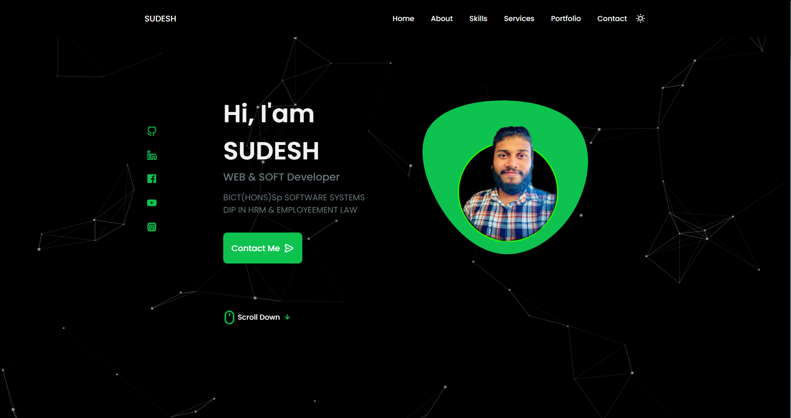
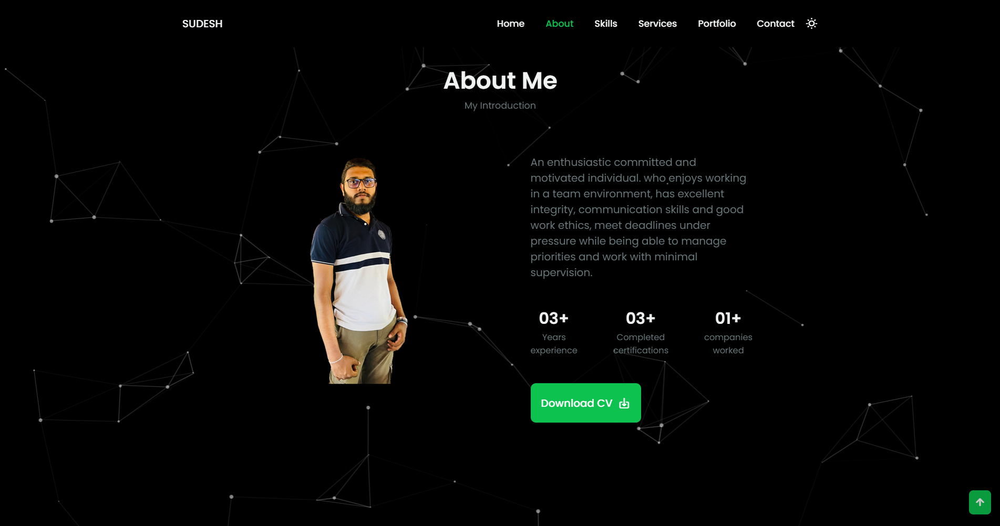
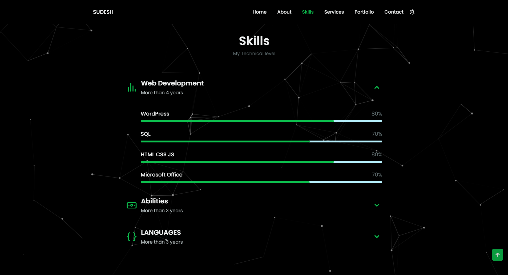
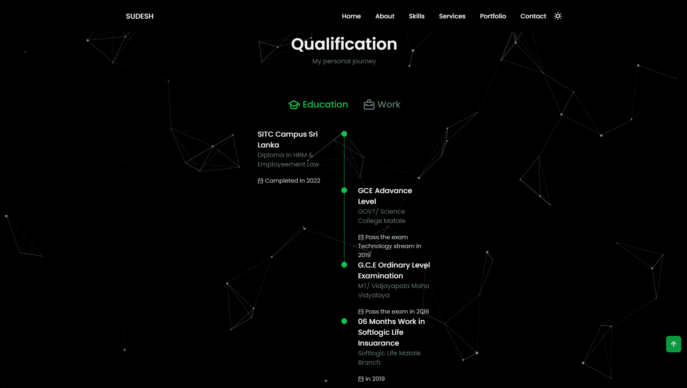
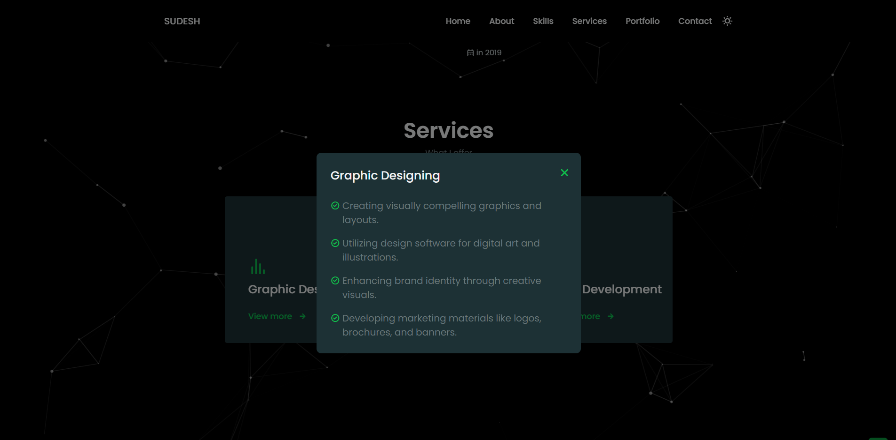
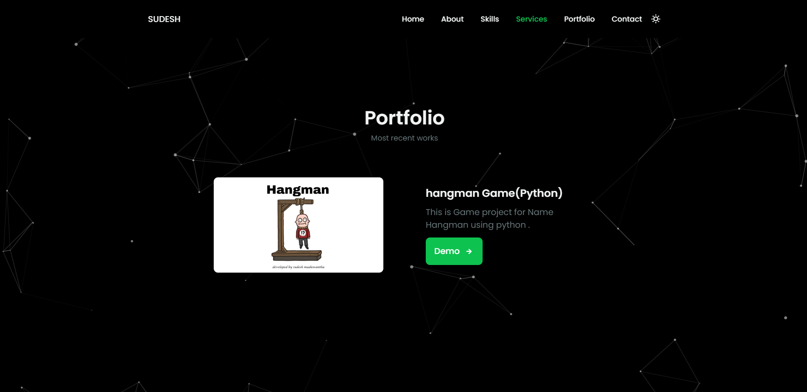
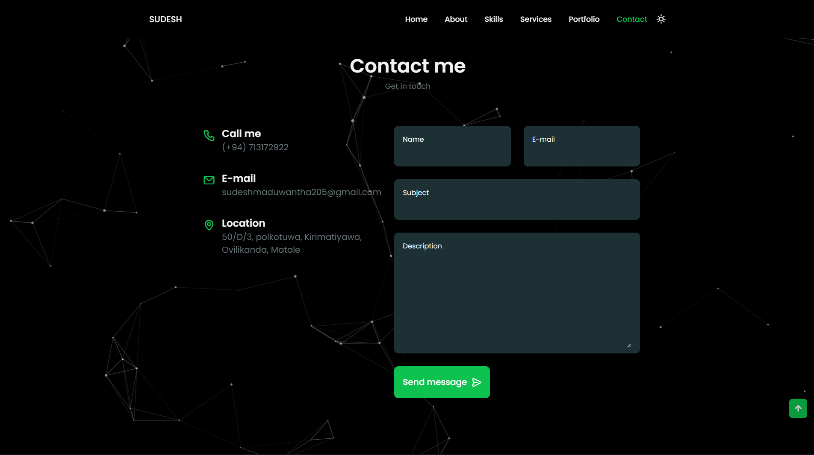
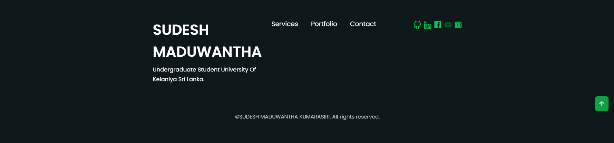

# My Portfolio
This is my personal website for showcasing my work, skills, and experiences as a web and software developer. The site is built using HTML, CSS, and JavaScript and includes sections for my introduction, skills, qualifications, portfolio, services offered, and contact information. The design is fully responsive and includes both light and dark themes, with a particle effect that enhances the visual experience.

## Screenshots

### Homepage

### About Section

### Skills Section

### Qualification Section

### Services Section

### Portfolio Section

### Contact Section

### Footer Section

# Features
Responsive Design: The website is fully responsive and optimized for all screen sizes, from mobile devices to large desktop monitors.
Theme Toggle: Users can switch between light and dark themes to suit their preferences.
Particles.js Integration: The landing page features a dynamic particle effect that adjusts based on the selected theme.
Interactive Portfolio: A showcase of my recent projects with demos and descriptions. Users can navigate through the projects using a swiper carousel.
Smooth Scrolling: All sections are linked for smooth scrolling navigation, providing a seamless user experience.
Contact Form: Visitors can contact me directly through a form, with fields for name, email, subject, and message.
Testimonial Section: Testimonials from past clients and collaborators highlight the quality of my work.

# Sections

1. Home
A brief introduction to who I am and what I do.
Links to my social media profiles (GitHub, LinkedIn, Facebook, YouTube, Instagram).

2. About Me
An overview of my background, including education, certifications, and work experience.
A downloadable resume is available for those who wish to learn more about my professional journey.

3. Skills
A detailed list of my technical skills, categorized into Web Development, Abilities, and Programming Languages.
Each skill is presented with a proficiency percentage bar.

4. Qualifications
A timeline of my educational and professional achievements, showcasing key milestones in my career.

5. Services
A list of services I offer, such as Graphic Designing, Web Development, and Software Development.
Each service includes a brief description and a modal with more details.

6. Portfolio
A collection of my most recent projects, each with an image, title, description, and link to a live demo or GitHub repository.
The projects are displayed in a swiper carousel for easy navigation.

7. Testimonials
Reviews and testimonials from clients and colleagues, highlighting the impact of my work.

8. Contact Me
A contact form for visitors to get in touch with me directly.
My contact information, including phone number, email, and location, is also provided.

## Technologies Used
HTML5: For structuring the content on the web pages.
CSS3: For styling the website, including animations, transitions, and responsive design.
JavaScript: For interactive elements such as theme toggling, smooth scrolling, and particles.js integration.
Swiper.js: For the responsive carousel used in the portfolio section.
Particles.js: For creating the dynamic particle effects on the landing page.
Unicons: For vector icons used throughout the site.
Google Fonts: For typography and enhancing the visual appeal.

## Installation and Setup
    1. Clone the repository:
        git clone https://github.com/SudeshMaduwantha/my-portfolio.git

    2. Navigate to the project directory:
        cd my-portfolio

    3. Open index.html in your browser to view the portfolio.

    4. Optional: To deploy the site, you can use platforms like GitHub Pages, Netlify, or Vercel.

# How to Use
Navigation: Use the navigation menu at the bottom of the page (or top on larger screens) to jump between sections.

Theme Toggle: Click the moon/sun icon in the navigation bar to switch between dark and light themes.

Portfolio: Browse through my projects using the arrows on the sides or swipe on mobile devices.

Contact: Fill out the contact form to send me a message directly from the website.

## Future Improvements
Blog Section: I plan to add a blog section where I can share insights, tutorials, and articles related to web development and software engineering.

Project Filtering: Enhance the portfolio section with filtering options to categorize projects by technology or type.

Backend Integration: Connect the contact form to a backend service to handle form submissions more robustly.

## Contributing
This is a personal project, but I welcome feedback and suggestions. If you find any issues or have ideas for improvements, feel free to open an issue or submit a pull request.

## License
This project is licensed under the MIT License. You are free to use, modify, and distribute this code as you see fit, with proper attribution.

## Contact
If you have any questions, feel free to reach out:
    Email: sudeshmaduwantha205@gmail.com
    LinkedIn: Sudesh Maduwantha
    GitHub: SudeshMaduwantha